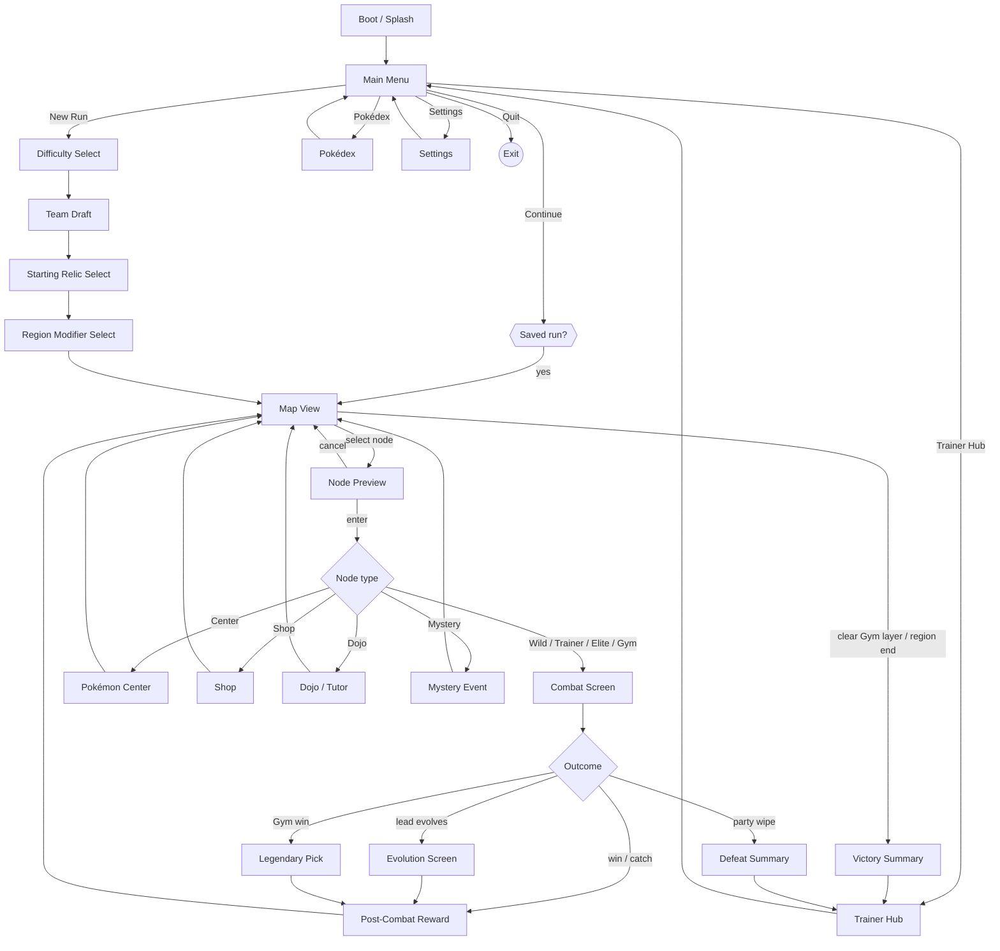
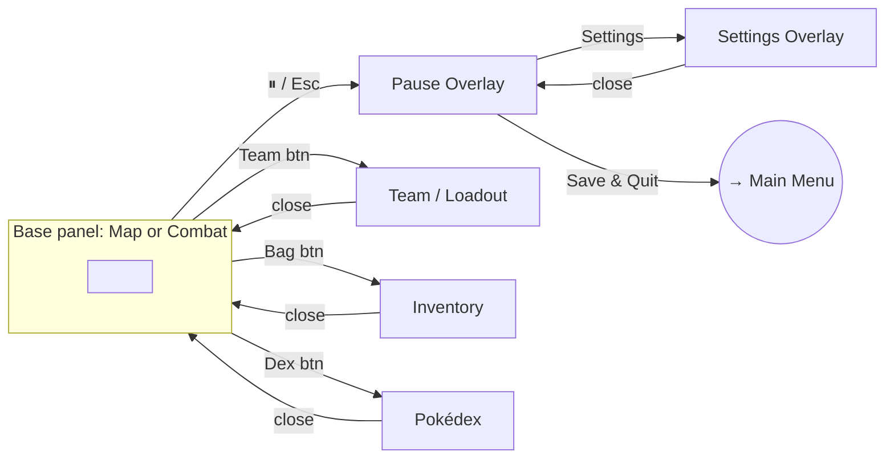

# Project Ascendant — UI Design Specification (Q23)

> **Status:** WIP draft (design/ — pre-Notion). Owner: producer + ui-programmer + art-director.
> **Purpose:** Define the complete UI of the game so Epic 13 implementation is a *translation*
> job (spec → UXML/USS), not a design job. On user approval this is ratified into GDD **Topic 10**
> as **CL-023** (resolves design question **Q23**) and re-exported.
>
> **Relationship to existing canon:** Topic 10 already specs the combat screen (§10.2), map view
> (§10.3), palette (§10.1.3), iconography (§10.4), audio (§10.5), accessibility (§10.6), UI Toolkit
> architecture (§10.7), animation (§10.9), localization (§10.10). This spec **extends** that, it does
> not contradict it. Where this spec changes an existing §, it is flagged `↻ CHANGE` and routed to
> `game-designer`/`systems-designer` before ratification.
>
> **Relationship to existing code:** every `Assets/Scripts/UI/*PanelUI.cs` today is a **temporary
> uGUI overlay** (gap #38 tech-debt, built imperatively so the Coplay bridge can screenshot it). The
> target below is **UI Toolkit** (§10.7). Epic 13 replaces the temp overlays screen-by-screen; this
> spec is that blueprint. No existing UXML/USS exists yet — this is greenfield in the right framework.

---

## Document set

| File | Covers |
|------|--------|
| `00-overview-and-scene-flow.md` | **(this file)** index, screen inventory, scene-flow architecture, UI router model |
| `01-design-system.md` | Standards: grid, tokens, type scale, component library, icon system, motion, input model |
| `02-combat-and-map.md` | Flagship gameplay screens (extends §10.2 / §10.3) |
| `03-run-flow-screens.md` | Main Menu, New-Run config, Node, Reward, Evolution, Legendary Pick, Victory/Defeat |
| `04-management-screens.md` | Team/Loadout, Inventory, Pokédex, TM/Move Manager, Shop, Center, Dojo |
| `05-meta-screens.md` | Trainer Hub, Achievements, Settings, Pause |
| `06-asset-icon-manifest.md` | Complete art/icon production list (art-director hand-off) |

Each screen spec uses a fixed template (purpose · layout zones · components · data bindings · interactions · states · accessibility), so every entry is implementation-ready and uniform.

---

## Screen inventory (complete)

**Boot & front-end**
1. Boot / Splash
2. Main Menu

**New-Run configuration (the setup before the map)**
3. Difficulty Select
4. Starter Select — single pick from the unlocked Starter pool (§2.1; Box starts with the Starter
   alone, team grows by in-run recruitment — *not* a multi-slot draft)
5. Starting Relic Select
6. Region Modifier Select (R1 pick, per-Region re-pick — CL-016)

**In-run core loop**
7. Map View (extends §10.3)
8. Node Preview / Confirm
9. Combat Screen (extends §10.2)
10. Post-Combat Reward (XP track + loot + catch result)
11. Evolution Screen
12. Legendary Pick (Gym victory — CL-021)

**Management (reachable from Map bottom bar and/or node screens)**
13. Team / Loadout (Active 3 + Box, drag-reorder)
14. Inventory (Relics · Consumables · Held Items)
15. Pokédex
16. TM / Move Manager
17. Shop (node)
18. Pokémon Center (node)
19. Dojo / Tutor (node — CL-009)

**Run end**
20. Victory / Run-Cleared summary
21. Defeat / Run-Over summary

**Meta (front-end, out of run)**
22. Trainer Hub (Trainer Card + PC Terminal kiosks)
23. Achievements
24. Settings (Display & Accessibility · Audio · Controls)

**Cross-cutting overlays (not full screens — components from `01-design-system`)**
25. Pause menu (in-run overlay)
26. Tooltip / hover damage-preview
27. Confirmation modal
28. Toast / notification
29. Loading / scene-transition curtain

---

## Scene-flow architecture

### Decision (to ratify) — Hybrid router model

> `↻ DECISION OD-1` (recommended; user may override at ratification)

The game uses **few Unity scenes + a UI Toolkit panel router**, not one scene per screen.

- **Unity scenes (4):** `Boot`, `FrontEnd` (main menu + hub + settings), `Run` (hosts Map *and*
  Combat — they swap the active root panel, not the scene), `_Persistent` (additive: audio, save,
  event-bus services, the UI router itself — never unloaded).
- **Everything in the Screen Inventory is a UI Toolkit panel** owned by a single **`UIRouter`** that
  manages a **panel stack** (push/pop) and a **layer model** (see `01-design-system §1.7`). Combat,
  Map, Hub are *base panels*; selects/inventory/pause are *pushed overlays*.

**Why hybrid (not scene-per-screen):** matches how the temp UI already layers overlays on
`MapViewUI`; avoids scene-load hitches mid-run; keeps run state resident in memory (no serialize/
deserialize on every menu open); UI Toolkit panels are cheap to show/hide. **Why not single-scene:**
Boot/FrontEnd/Run separation keeps the run's combat assets out of the menu's memory footprint and
gives clean load boundaries for save/resume (§9.8). *Alternative considered:* pure additive
scene-per-screen — rejected for load-hitch + state-marshalling cost.

### Macro flow (front-end → run → end)

### In-run overlay layer (pushed on top of Map or Combat, never replaces them)

---

## Modal vs full-screen classification

| Screen | Presentation | Pushed over | Dismiss |
|--------|-------------|-------------|---------|
| Main Menu, Hub, Map, Combat | **Base panel** (full) | — | route change only |
| Difficulty / Team Draft / Relic / Region-Mod / Legendary Pick | **Full-screen step** (linear, has Back where reversible) | base | Back / Confirm |
| Node Preview | **Anchored popover** (near the node) | Map | Enter / Cancel |
| Reward, Evolution, Victory, Defeat | **Full-screen result** (forward-only, Continue) | base | Continue |
| Team, Inventory, Pokédex, TM/Move, Shop, Center, Dojo | **Full overlay** | base | Close (Esc) |
| Pause | **Dim modal** | base | Resume (Esc) |
| Confirmation, Tooltip, Toast | **Component overlay** | anything | per component |

> **Reversibility rule (Pillar 2 "every decision counts"):** New-Run config steps are reversible with
> **Back** *until* the first node is entered. Once a run-defining choice locks (Region Modifier
> confirmed → map generated from seed), it cannot be re-picked that Region — the confirm uses a
> Confirmation modal. This is a deliberate readability/decision-weight contract, not a tech limit.

---

## Transition language (summary — full motion spec in `01-design-system §1.6`)

| Transition | Motion | Duration | Reduced-motion |
|-----------|--------|----------|----------------|
| Scene change (Boot→FrontEnd→Run) | Curtain wipe | 400 ms | instant cut |
| Base panel swap (Map↔Combat) | Cross-fade + 1.02 scale settle | 300 ms | instant |
| Push overlay (inventory, pause) | Slide-up 24px + fade | 220 ms | fade-only 120 ms |
| Result reveal (reward, evolution) | Staggered element fade-in | 250 ms + 40 ms stagger | all at once |
| Popover (node preview, tooltip) | Fade + 6px rise | 120 ms | fade-only |

---

## Open decisions to ratify (flagged, not assumed)

| ID | Decision | Recommendation | Owner |
|----|----------|----------------|-------|
| OD-1 | Scene/router model | Hybrid (4 scenes + UIRouter panel stack) — above | ui-programmer + unity-specialist |
| OD-2 | New-Run config order | Difficulty → Starter → Relic → Region-Mod | game-designer |
| ~~OD-3~~ | ✅ RESOLVED (§2.1): single **Starter Select**, not a multi-slot draft. Box starts with the Starter alone; team grows via recruitment. | — |
| ~~OD-4~~ | ✅ RESOLVED (§2.3): Team/Loadout is **Map-only**, locked on node entry. No mid-combat loadout; in-combat consumables are the in-hand cards only (§10.2.2.4). | — |
| OD-5 | Settings reachable mid-run via Pause writes only? (Settings load gap #47) | UI assumes working load; flag #47 as blocker for Settings persistence | lead-programmer |

These are resolved with the user during the screen-by-screen pass and recorded in
`design/open-questions.md` before CL-023 is written to Notion.
