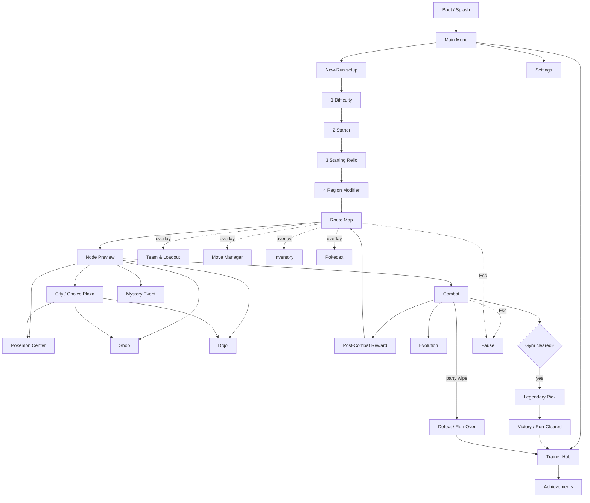

<!-- AUTO-GENERATED SNAPSHOT — DO NOT EDIT DIRECTLY -->
<!-- Last updated from Notion: 2026-06-18T10:23:00.000Z -->

**Status:** 🟢 In Progress


**Last Updated:** 2026-06-18 (CL-023 — full screen-by-screen UI design pass: warm two-theme palette, squad-formation combat layout, every-screen spec + scene flow in §10.12, accessibility deferred post-VS)


**Cross-references:** Topic 1 (cheerful core + regional flavor pillar), Topic 3 (combat phases, Lead/bench), Topic 4 (intent display, status icons, type effectiveness UI), Topic 6 (Trauma UI), Topic 7 (Region palettes), Topic 9 (UI Toolkit architecture).


---


# §10.1 Visual Style


## §10.1.1 Art Style Statement


**Clean, modern 2D pixel art with high-saturation type palettes.** Reference baseline: HD-2D illustration sensibility (depth via lighting, not 3D), Gen 5/6-style sprite craftsmanship, deckbuilder UI minimalism (Slay the Spire / Monster Train clarity over decoration).


**Tonal alignment:**

- Base mode: **cheerful, warm, vibrant**. Pillar 5 alignment.
- Regional accent: each Region introduces its own palette and lighting, never breaking the cheerful base — even Volcanic Highlands is "intense and dramatic," not "grim."

**Two-theme system (CL-023).** The shipped UI runs two coordinated warm themes: a **warm-light front-end** (cream surfaces, warm-brown ink — menus, map, node services, management, run-end, meta) and a **warm-dim combat stage** (deep-plum surface, warm-cream ink) for the in-combat screen. Display font **Baloo 2** (rounded); body font **Nunito**; iconography is the Tabler outline set (final SVG icons per §10.4). The full design system + per-screen mockups are maintained as living references in `design/ui/` (specs `00`–`10` + `mockups/*.html`); §10.12 is the canonical decision record.


## §10.1.2 Sprite Specifications


| Asset                              | Resolution           | Notes                              |
| ---------------------------------- | -------------------- | ---------------------------------- |
| Pokémon portrait (battle)          | 96×96 px             | Center-anchored; 1.5× scaled in UI |
| Pokémon portrait (map view, small) | 32×32 px             | Pixel-accurate downscale           |
| Enemy battle sprite                | 96×96 px             | Same as player Pokémon             |
| Move card art                      | 144×96 px            | Landscape; framed by card chrome   |
| Relic icon                         | 64×64 px             | Square; rarity-tinted border       |
| Held Item icon                     | 32×32 px             | Small; equipped-state overlay      |
| Consumable icon                    | 48×48 px             | In-hand: 64×96 (card-framed)       |
| Background (combat)                | 1920×1080 px logical | Parallax-layer-ready               |
| Background (map view)              | 1920×1080 px logical | Single-layer; pannable             |


## §10.1.3 Color Palette (Master)


### §10.1.3.1 Core UI Palette  ↻ CL-023

> **↻ CHANGED (CL-023, 2026-06-18).** The original dark navy palette is **superseded** by the warm two-theme system below.

**Warm-light front-end** (menus · map · node services · management · run-end · meta):


| Token             | Hex     | Use                                       |
| ----------------- | ------- | ----------------------------------------- |
| `--surface-0`     | #FBF4E6 | Page background (cream)                   |
| `--surface-1`     | #FFFDF8 | Cards, raised tiles                       |
| `--surface-2`     | #F3E7D0 | Panels, headers                           |
| `--ink-primary`   | #3A2E22 | Headings, key data (warm brown)           |
| `--ink-secondary` | #6B5A45 | Body text                                 |
| `--ink-muted`     | #A8967C | Labels, disabled                          |
| `--border`        | #E4D4B5 | Card / panel borders                      |
| `--accent-action` | #FFCB3D | Primary buttons, playable glow, AP (gold) |
| `--brand-red`     | #E84C4C | Poké-Ball brand mark, danger accents      |
| `--positive`      | #54D98A | Heals, gains, XP                          |
| `--negative`      | #E24B4A | Damage, costs, faint                      |
| `--warning`       | #C99A1E | Status, Trauma, can't-afford              |


**Warm-dim combat stage** (in-combat screen only) — reuses the accent tokens over a dark warm surface:


| Token                   | Hex     | Use                                 |
| ----------------------- | ------- | ----------------------------------- |
| `--surface-0` (stage)   | #2A2230 | Combat stage background (deep plum) |
| `--ink-primary` (stage) | #FFF6EC | On-stage text (warm cream)          |


Fonts: **Baloo 2** (display/headings) · **Nunito** (body). Type hues unchanged (§10.1.3.2); type icons ship at `Assets/Sprites/UI/Icons/Type/`.


### §10.1.3.2 Pokémon Type Palette (15 types — Gen I)


| Type     | Hex     | Use                |
| -------- | ------- | ------------------ |
| Normal   | #A8A878 | Beige, neutral     |
| Fire     | #F08030 | Saturated orange   |
| Water    | #6890F0 | Sky blue           |
| Electric | #F8D030 | Lemon yellow       |
| Grass    | #78C850 | Apple green        |
| Ice      | #98D8D8 | Pale cyan          |
| Fighting | #C03028 | Brick red          |
| Poison   | #A040A0 | Saturated purple   |
| Ground   | #E0C068 | Sandy yellow-brown |
| Flying   | #A890F0 | Lavender           |
| Psychic  | #F85888 | Pink magenta       |
| Bug      | #A8B820 | Olive              |
| Rock     | #B8A038 | Tan-brown          |
| Ghost    | #705898 | Muted purple       |
| Dragon   | #7038F8 | Deep violet        |


All type colors verified for WCAG AA contrast against `--bg-primary` and `--bg-secondary`.


---


# §10.2 Combat Screen Layout


## §10.2.1 Master Layout (squad formation)  ↻ CL-023

> **↻ CHANGED (CL-023, 2026-06-18).** The combat stage is re-laid-out to the **squad formation** (canonical mockup: `design/ui/mockups/combat-screen-final.html`, spec `design/ui/02 §2.1`):
> - **Player Active 3 cluster on the LEFT** — **Bench 1 top-left**, **Bench 2 bottom-left** (stacked, same size, each with a swap button + AP cost chip), and the **Lead leading forward to the right** of the two benches, **no overlap**.
> - **Single enemy is the default**, drawn **enlarged / imposing** and anchored on the **right**; 2–3 enemies use the same squad-cluster grammar.
> - **No intent arrows** — the enemy's intent is a **chip above it** (icon + magnitude + target label).
> - **Catch gauge** (wild encounters only) is a **detached pill** beside the enemy frame, not overlaid (CL-014, §7.3.4).
> - Hand tray along the bottom; the **damage preview is compact and appears next to the targeted Pokémon** when a card is dragged onto a target.
> 
> The ASCII below is the **legacy wireframe**, retained for zone-sizing reference only.

```javascript
┌─────────────────────────────────────────────────────────────────┐
│  [Region Modifiers]    [Boons]    [Field Effect]   ⏸ Menu       │ ← 60px top bar
├─────────────────────────────────────────────────────────────────┤
│                                                                  │
│                            ENEMY ZONE                            │ ← Enemy battle area
│        [Enemy Sprite + Intent + HP Bar + Status Icons]           │   (top 40% height)
│                                                                  │
├─────────────────────────────────────────────────────────────────┤
│                                                                  │
│        [Bench L]    [LEAD POKÉMON]   [Bench R]                   │ ← Player Active Team
│         HP bar      HP bar (large)    HP bar                     │   (mid 30% height)
│         status      status            status                     │
│                                                                  │
├─────────────────────────────────────────────────────────────────┤
│  AP: ●●● │ Deck: 8 │ Discard: 3 │ Hand:                          │ ← Bottom bar
│                                                                  │
│   [Card1] [Card2] [Card3] [Card4] [Card5] │ [Cons1] [Cons2]      │ ← Hand
│   skill cards (5)                            consumables (2)     │
│                                                                  │
│                                                       [End Turn] │
└─────────────────────────────────────────────────────────────────┘
```


## §10.2.2 Zone Specifications


### §10.2.2.1 Top Bar (60px)


Persistent status row. Always visible. Hover any badge to see full text. Stacks left-to-right: Region Modifiers → Boons → Field Effects → Pause/Menu.


### §10.2.2.2 Enemy Zone (40% height, ~410px)

- Single enemy: centered, sprite 240×240 scaled.
- Multi-enemy: 1 Lead + 1–2 supports. Lead enemy in center; supports flank.
- Intent display: directly above each enemy. Format: `[icon] [magnitude] → [target label]`.
- HP bar: directly below sprite. Phase markers visible for boss-tier (§4.4.3).
- Status condition icons: row below HP bar.
- Pokédex tier badge: top-right corner of enemy frame (Familiar / Veteran / Master).

### §10.2.2.3 Player Active Team Zone (30% height, ~324px)

- 3 portraits: Bench-Left, LEAD (raised forward + larger), Bench-Right.
- Lead is visually distinguished: 1.25× scale, slight forward offset, gold-tinted frame.
- HP bar below each portrait. Trauma badge (§6.2.5) overlaid on portrait.
- Status condition icons row below HP bar.
- Stat stage icons (separate row): up/down arrows with stage numbers (`Atk +1`).
- Lead Aura indicator (§5.5.4): persistent buff icon under Lead portrait, tinted to Aura's type.

### §10.2.2.4 Bottom Bar / Hand Zone (~340px)

- AP pip display (left): 3 base pips, lit/dimmed based on remaining AP.
- Deck/Discard counts.
- Skill cards (5): fanned, card-game style.
- Consumable cards (2): visually distinct (rounded vs angular).
- "End Turn" button (right): prominent, color-shifts to gold when player has no playable affordable cards.

## §10.2.3 Card Anatomy


```javascript
┌───────────────────┐
│ [Type] [AP cost]  │ ← Header
│ ┌───────────────┐ │
│ │   Card Art    │ │ ← 144×96 art slot
│ │               │ │
│ └───────────────┘ │
│ Move Name         │ ← Title (large)
│ [Tags: R, SF...]  │ ← Tag row
│ Effect text...    │ ← Body
│                   │
│ Pwr 80 (× STAB)   │ ← Stats footer
└───────────────────┘
```

- AP cost: yellow pip stack, top-right.
- Type: 15-type color band, top-left.
- Range icon: ⚔ Melee / 🏹 Ranged.
- Modifier icon: ▲ Step-Forward / ▼ Step-Backward (only when present).
- Status rider: small condition icon at bottom-right of art slot.
- Unplayable state: 60% desaturated, NOT hidden (per `ui.md` rule).

## §10.2.4 Hover / Drag State (Damage Preview)


Hovering a card with a target selected — or, in the squad layout, **dragging a card onto a target** — reveals a **compact preview placed next to the targeted Pokémon** (CL-023):


```javascript
┌─────────────────────────────────┐
│ Tackle on Charmander            │
│                                 │
│ Predicted damage: 48            │
│ Base 40 × STAB 1.5 × Type 1.0   │
│                                 │
│ ⚡ Crit chance: 25%             │
│ ☑ Will apply: (nothing)         │
└─────────────────────────────────┘
```


Always shows: final calculated damage, the breakdown, crit chance, status rider details, redundancy warnings (e.g., "Already Burned" if attempting to re-apply).


## §10.2.5 Intent Display Vocabulary


| Icon | Intent              | Display                                                     |
| ---- | ------------------- | ----------------------------------------------------------- |
| ⚔️   | Attack(N, slot)     | `⚔ N → Lead` or `⚔ N → Bench-L (Squirtle)`                  |
| ⚔🌐  | Cleave(N)           | `⚔ N → ALL SLOTS` (with sweep arrow visual)                 |
| 🎯   | Backstrike(N, slot) | `🎯 N → Bench-L (Squirtle)`                                 |
| ⬆    | Buff(stat)          | `⬆ Atk +1`                                                  |
| 🛡   | Stall               | `🛡 +1 stage Def`                                           |
| 💢   | Status(condition)   | `💢 BURN → Lead`                                            |
| ❓    | Unknown             | `❓` (interactable: tooltip says "Unrevealed — see Pokédex") |


---


# §10.3 Map View Layout


```javascript
┌────────────────────────────────────────────────────────────────┐
│ Region 1 — Verdant Route       💰 350₽   ⭐ 240 XP   🎒 Items │ ← Top bar
├───────────────────────┬────────────────────────────────────────┤
│                       │                                        │
│   [Active Team]       │              [Map Graph]               │
│   [Lead] [B][B]       │       Layer 0  ●                       │
│                       │       Layer 1   ● ● ●                  │
│   [Box (Reorderable)] │       Layer 2   ●─●─●                  │
│   ─────────────       │       ...                              │
│   [⚪ Box-1]          │       Layer 7   👑 ← Gym Layer         │
│   [⚪ Box-2]          │                                        │
│   [⚠ Box-3 Trauma]   │  Current location: Layer 2             │
│   ...                 │                                        │
├───────────────────────┴────────────────────────────────────────┤
│ [Inventory]  [Pokédex]  [Settings]                  [Save&Quit]│
└────────────────────────────────────────────────────────────────┘
```

- Active Team panel (left): drag-and-drop reordering; visual Lead distinction.
- Map graph (right): branching, with layer markers; current location highlighted; future nodes show their type icons.
- Bottom bar: utility access.

---


# §10.4 UI Iconography Reference


## §10.4.1 Node Type Icons (Map View)


| Node              | Icon              |
| ----------------- | ----------------- |
| Wild Pokémon Area | 🌿 (biome-tinted) |
| Trainer Battle    | 👤                |
| Elite Trainer     | 👤⭐               |
| Pokémon Center    | ❤️                |
| Shop              | 🛒                |
| Tutor / Daycare   | 📜                |
| Mystery Event     | ❓                 |
| Gym Leader        | 👑                |
| City              | 🏙️               |


## §10.4.2 Resource & State Icons

- AP: ● (yellow pip)
- Poké Dollar: ₽
- Trainer XP: ⭐
- Trainer Token: 🪙
- Trauma stack: ⚠
- Mastery tier: 🏆

## §10.4.3 Status Condition Icons


| Condition | Icon | Color tint       |
| --------- | ---- | ---------------- |
| Burn      | 🔥   | --type-fire      |
| Poison    | ☠️   | --type-poison    |
| Paralysis | ⚡    | --type-electric  |
| Sleep     | 💤   | desaturated blue |
| Freeze    | 🧊   | --type-ice       |
| Confusion | 💫   | yellow-magenta   |


---


# §10.5 Audio Design


## §10.5.1 Audio Direction Statement


**Layered orchestral-electronic hybrid**, regionally themed. Combat audio is high-density (multiple stems for setup/aggression/desperation). Map audio is ambient-forward.


**Core principles:**

- Every player action has audio feedback (card play, swap, end-turn).
- Status conditions have musical motifs (Burn = subtle crackle layer, etc.).
- Boss fights have unique tracks; standard combat reuses Region tracks.

## §10.5.2 Audio Stems (Combat)


| Stem                           | Trigger                       |
| ------------------------------ | ----------------------------- |
| `combat_base`                  | Combat start; always playing  |
| `combat_low_hp_layer`          | Active Team total HP < 30%    |
| `combat_setup_layer`           | First 2 turns of a boss fight |
| `combat_signature_phase_layer` | Boss Phase 2/3                |
| `combat_victory_sting`         | Combat win                    |
| `combat_defeat_sting`          | Run loss                      |


Stems crossfade with 250ms ramps.


## §10.5.3 Audio Cues — SFX Bible


| Action                   | SFX                                                  |
| ------------------------ | ---------------------------------------------------- |
| Play skill card          | Type-coded "whoosh" (Fire = crackle, Water = splash) |
| Play consumable          | Soft chime                                           |
| Manual swap              | Confident step + soft chord                          |
| Step-Forward effect      | Forward whoosh                                       |
| Step-Backward effect     | Reverse whoosh                                       |
| Faint                    | Soft "fall" + dim color                              |
| Status applied           | Type-coded sting                                     |
| Crit                     | Crystalline "ping" overlay                           |
| Super-effective hit      | Heavy impact with high-frequency layer               |
| Resisted hit             | Muted thud                                           |
| Card draw                | Paper-shuffle                                        |
| Hand refresh             | Cardstock fan                                        |
| End turn confirm         | Solid bell                                           |
| Boss evolution telegraph | Rising electronic tension                            |
| Boss evolution complete  | Orchestral hit + screen flash                        |


## §10.5.4 Regional Music Themes

- **Region 1 — Verdant Route:** Light flute + acoustic strings + birdsong ambient. ~110 BPM. Major key.
- **Region 2 — Coastal Cliffs:** Brass + crashing-wave foley + tense strings. ~115 BPM. Minor key.
- **Region 3 — Volcanic Highlands:** Percussion + brass + electronic sub-bass. ~125 BPM. Modal minor.
- **City interstitials:** Each City has a "rest hub" jingle — warm, looped, evocative of Pokémon Center theme tradition.
- **Victory Road:** Sparse, cinematic strings + sustained brass. Slow tempo (~85 BPM). Builds tension.
- **League:** Each Elite has a unique track; Champion has a 3-phase dynamic composition.

## §10.5.5 Audio Mix Targets

- Master bus: -14 LUFS integrated loudness (modern game standard).
- Music bus: -18 LUFS.
- SFX bus: -16 LUFS peak.
- All audio normalized at authoring time; runtime mixing via Unity AudioMixer snapshots.

---


# §10.6 Accessibility  ↻ CL-023

> **↻ CHANGED (CL-023, 2026-06-18, user decision).** Accessibility is **no longer mandatory-launch** — the full suite below is **deferred to a post-VS accessibility epic**. The **Vertical Slice Settings ship bare basics only**: **Audio** (Master / Music / SFX) · **Display** (Fullscreen) · **Game** (Language), mapping to the existing `SettingsSO` fields (LoadSettings + boot-restore done, BACKLOG #47; mockup `design/ui/mockups/settings-basic.html`). The list below is **retained as the post-VS epic spec**.

## §10.6.1 Accessibility Features (post-VS epic — formerly "mandatory launch")

1. **Colorblind modes:** Deuteranopia, Protanopia, Tritanopia palette swaps. Selectable at boot or via Settings. Type colors remap; type icons gain pattern overlays (stripes/dots) so they're distinguishable WITHOUT color.
2. **Text size:** UI text scales 80% / 100% / 125% / 150% via Settings. All UI elements designed at 150% to ensure no clipping at max scale.
3. **Reduced motion mode:** Disables card-fan animations, screen shakes, parallax, particle flourishes. Game-state animations (HP bar fill, faint animation) play in instant mode.
4. **Damage preview always-on option:** Toggle to keep damage preview visible without requiring hover.
5. **Skip animations option:** Combat resolution animations can be set to instant.
6. **Subtitles for audio cues:** Optional text feedback for SFX-only signals (e.g., "Crit!", "Super effective!").
7. **Key rebinding:** Every input action remappable. Two profiles (Profile A / B).
8. **Pause anywhere:** Pause is available between turns AND mid-Action-Phase.

## §10.6.2 Screen-Reader Support (Post-launch)


Architecture commitment: every interactive UI element has a `data-aria-label` analog (Unity UI Toolkit `accessibility` properties). Screen-reader plumbing deferred to post-launch.


## §10.6.3 Cognitive Accessibility

- Tutorial mode: longer telegraphs, slower pacing for first-run players.
- "Hint" overlay: optional, suggests strong card plays for that turn. Off by default; can be enabled in Settings without telemetry penalty.
- Pokédex "study mode": pre-combat preview of enemy intent pool against current Active Team's type matchups.

## §10.6.4 Photosensitivity

- All flashes/screen-shakes capped at frequencies safe under PEAT (Photosensitive Epilepsy Analysis Tool) guidelines.
- Reduced motion mode disables all flashes entirely.

---


# §10.7 UI Toolkit Architecture


## §10.7.1 UI Framework


**UI Toolkit (Unity 6)** is the canonical UI system. Legacy uGUI / Canvas is **forbidden for new screens**. Per `unity/VERSION.md`.


## §10.7.2 USS / UXML Conventions

- Per-screen `.uxml` files for layout.
- Shared `theme.uss` for tokens (color tokens defined in §10.1.3 as CSS variables).
- Per-component USS for component-specific styles.
- BEM-style class naming: `.combat-card`, `.combat-card--unplayable`, `.combat-card__type-band`.

## §10.7.3 Event-Driven Updates


UI components subscribe to ScriptableObject event channels (§9.4.1.1) for state updates. **No polling in UI Update loops.** Per `ui.md`: UI never owns game state.


## §10.7.4 Damage Preview Implementation Note


The hover damage preview is computed by calling `DamageCalculator.Preview(card, target)` which returns a `DamageBreakdown` struct. UI binds to this struct. The calculator is pure (no side effects); calling it from hover events is cheap.


---


# §10.8 Mobile Portability (Acknowledged, Not Launch)


UI Toolkit's layout system uses logical units (em / %), making rescaling straightforward.


**Mobile-portability commitments WITHOUT dedicated effort:**

- All hit targets ≥ 44×44 dp equivalent (touch-friendly even on desktop).
- No mouse-hover-only interactions (every hover has a tap-equivalent for mobile parity).
- Persistent tooltip toggle (so a tap can lock-show a tooltip).
- Layout reflows tested at 4:3, 16:9, 16:10, 18:9, 21:9 aspect ratios.

Full mobile port is a roadmap item, not a launch commitment.


---


# §10.9 Animation Style


## §10.9.1 Pokémon Animation

- **Idle:** 2-frame breath loop.
- **Attack:** 4-frame lunge or projectile spawn.
- **Damaged:** 1-frame flash + 2-frame recoil.
- **Faint:** 3-frame fade.
- **Evolution:** Special 8-frame animation triggered in Map View on evolution.

## §10.9.2 Card Animation

- Draw: slide-in from deck position, 200ms.
- Play: lift, glow, fade-out toward target, 350ms total.
- Discard: subtle fade to discard pile, 150ms.
- Hand refresh: cascade fan-in.

## §10.9.3 Camera & Screen Effects

- Combat: locked camera; no movement. Subtle 1px screen-shake on heavy hits.
- Map: smooth pan to selected node.
- Boss intro: 1.5s camera zoom + dramatic chord.
- Reduced motion mode: eliminates all of the above.

---


# §10.10 Localization Architecture


## §10.10.1 String Authoring

- **Every user-facing string** lives in a localization table — no hardcoded display text. Per `ui.md` rule.
- Localization keys use namespace dot notation: `combat.card.tackle.name`, `ui.button.end_turn`.
- Unity Localization package backs the implementation.

## §10.10.2 Launch Locales


| Locale           | Launch  | Notes                                                         |
| ---------------- | ------- | ------------------------------------------------------------- |
| English (en-US)  | ✅       | Primary                                                       |
| Spanish (es-ES)  | Stretch | Half of original Drive design is in Spanish — easy to surface |
| French (fr-FR)   | Roadmap | —                                                             |
| Japanese (ja-JP) | Roadmap | Requires CJK font integration                                 |


---


# §10.11 Vertical Slice Carve-Out


| System                              | In VS                                                       | Out of VS                                                                                                      |
| ----------------------------------- | ----------------------------------------------------------- | -------------------------------------------------------------------------------------------------------------- |
| Combat screen layout                | ✅ Full                                                      | —                                                                                                              |
| Card anatomy + hover damage preview | ✅ Full                                                      | —                                                                                                              |
| Map view layout                     | ✅ Region 1 scope                                            | City + Victory Road + League screens                                                                           |
| Iconography                         | ✅ Full type + status + node icons                           | Pokédex mastery visual polish                                                                                  |
| Audio bible                         | ✅ Combat stems (R1) + 1 boss track                          | R2/R3 themes, full SFX bible polish                                                                            |
| Accessibility (↻ CL-023)            | ✅ Bare-basics Settings only (Audio · Fullscreen · Language) | Full a11y suite (colour-blind, text-size, reduced-motion, subtitles, photosensitivity, rebinds) → post-VS epic |
| UI Toolkit theme system             | ✅ Full                                                      | —                                                                                                              |
| Animation suite                     | ✅ All combat anims                                          | Evolution animation polish                                                                                     |
| Localization architecture           | ✅ Hookup                                                    | Only en-US locale shipped                                                                                      |


---


# §10.12 Screen-by-Screen UI Spec & Scene Flow  (CL-023)


**Added CL-023 (2026-06-18)** — ratifies the full UI design pass (resolves Q23). Every game screen now has a written spec (`design/ui/00`–`10`) and a visual mockup (`design/ui/mockups/*.html`). Those files are the **living detail reference** (purpose · zones · components · bindings · interactions · states); this section is the canonical decision record and screen inventory. Art slots use real Pokémon portraits + the type-icon set (fan-portfolio scope); backgrounds are placeholder pending the art pass.


## §10.12.1 Scene Flow





## §10.12.2 Screen Inventory


| Cluster      | Screen                | Canonical mockup         | Key decisions ratified                                                                                   |
| ------------ | --------------------- | ------------------------ | -------------------------------------------------------------------------------------------------------- |
| Front-end    | Boot / Splash         | boot-splash.html         | Logo lockup + fan disclaimer + loading bar                                                               |
| Front-end    | Main Menu             | main_menu_screen         | Warm-light kiosk menu                                                                                    |
| Front-end    | Trainer Hub           | trainer_hub_screen       | Trainer Card + PC Terminal kiosks (§6.4)                                                                 |
| Front-end    | Achievements          | achievements.html        | Medal tiers, hidden, count + Tokens (CL-020)                                                             |
| Front-end    | Settings              | settings-basic.html      | Bare basics (Audio / Fullscreen / Language); a11y deferred (§10.6)                                       |
| New-Run      | 1 Difficulty          | newrun-1-difficulty.html | Modifier + Trainer-XP reward per tier                                                                    |
| New-Run      | 2 Starter             | newrun-2-starter.html    | Real portraits; type top-left on tile, type chip off-photo in detail                                     |
| New-Run      | 3 Starting Relic      | newrun-3-relic.html      | Scrollable rarity-tinted grid                                                                            |
| New-Run      | 4 Region Modifier     | newrun-4-region.html     | Curated 3-offer + run-lock confirm (CL-016)                                                              |
| In-run       | Route Map             | map_screen               | Squad team panel + branching graph                                                                       |
| In-run       | Node Preview          | node-preview.html        | Anchored popover; encounters + rarity + tier + reward (§3.4)                                             |
| In-run       | Combat                | combat-screen-final.html | Squad formation; enlarged enemy; detached catch pill; no intent arrows (§10.2)                           |
| In-run       | Post-Combat Reward    | post_combat_reward       | Win XP + drops                                                                                           |
| In-run       | Evolution             | evolution_screen         | Archetype pick (CL-007)                                                                                  |
| In-run       | Legendary Pick        | legendary-pick.html      | Gym 1-of-3 gold, max-2/run (CL-021)                                                                      |
| Node service | Pokémon Center        | pokemon-center.html      | Heal before→after bars; optional Trauma Care (§6.2 flag)                                                 |
| Node service | Shop / Mart           | shop.html                | Scrollable compact stock; buy panel + spend preview; can't-afford / sold-out                             |
| Node service | Dojo / Tutor          | dojo-tutor.html          | 4 slots + empty placeholder + locked Mastery; pick-slot teach; priced services + CL-008 ability (CL-009) |
| Node service | City / Choice Plaza   | city-plaza.html          | Aerial town, clickable buildings (StS-style stop); pick one, others close (CL-015)                       |
| Node service | Mystery Event         | mystery-event.html       | Event card; telegraphed-outcome choices (Pillar 1)                                                       |
| Management   | Team & Loadout        | team-loadout.html        | Active 3 (Lead crowned) + Box drag-swap (§4.1)                                                           |
| Management   | Move Manager          | move-manager.html        | Kit 4/4 + Mastery; teach / replace                                                                       |
| Management   | Inventory             | inventory_screen         | Relics · Consumables · Held                                                                              |
| Management   | Pokédex               | pokedex_screen           | Tiered knowledge view                                                                                    |
| Run end      | Victory / Run-Cleared | victory-summary.html     | Stats + XP / Tokens + level-up unlock + achievements                                                     |
| Run end      | Defeat / Run-Over     | defeat-summary.html      | Warm, not punishing; rewards kept (Pillar 5)                                                             |
| Overlay      | Pause                 | pause-menu.html          | Resume / Settings / Save & Quit / Abandon; mid-combat autosave note (§5.4)                               |


## §10.12.3 Notable specs

- **Combat squad formation** — see §10.2 (rewritten under CL-023).
- **Dojo pick-slot teach (§4.7 / CL-009):** the move kit always renders **4 slots** (filled or empty placeholder) plus the **locked Mastery 5th**; teaching is a **player choice of which slot to fill or overwrite** (an empty slot fills with nothing lost; Mastery is never a replace target).
- **City Choice Plaza (CL-015):** presented as a **top-down aerial town** with **clickable building destinations** (Pokémon Center, Poké Mart, Move Dojo, Black Market). Pick one — the rest close (Pillar 2/3). The Black Market reuses the Shop chrome with the gold + max-2 Legendary rule (CL-021).
- **Heal preview (§4.6):** team rows show the heal as **before→after** (solid = current HP, hatched = restored amount).
- **Telegraphed events (Pillar 1):** Mystery Event choices show outcome tags (gain / cost / risk) — never blind RNG.
- **Settings = bare basics** for the VS (§10.6); the accessibility suite is a post-VS epic.
> **Living references.** Full per-screen template specs live in `design/ui/02`–`05`; the design system (warm themes, fonts, components, type hues) in `design/ui/01`; the coverage audit in `design/ui/10-coverage-matrix.md`.
