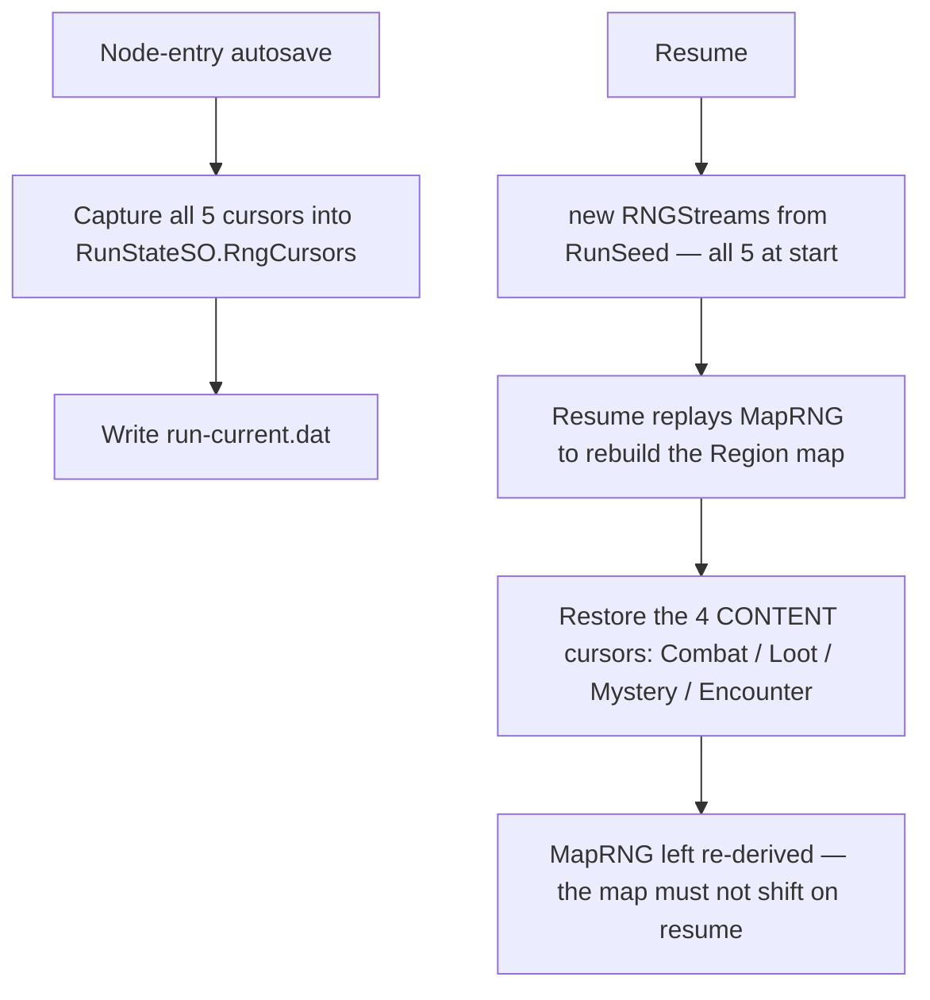

<!-- AUTO-GENERATED SNAPSHOT — DO NOT EDIT DIRECTLY -->
<!-- Last updated from Notion: 2026-06-12T09:51:00.000Z -->

**Status:** 🟢 In Progress


**Last Updated:** 2026-05-24 (SO schemas, Event Bus, HSM, Factory, RNG, save, addressables, testing)


**Cross-references:** Topic 1 (§1.3.2 Engineering Pillars), Topic 3 (combat phase events), Topic 4 (damage formula inputs), Topic 6 (MetaProgressionSO), Topic 8 (item SOs), every other Topic.


---


# §9.1 Architecture Pillars (re-grounded from §1.3.2)

1. **Data-driven content.** Every game value — stats, moves, relics, items, AI weights, balance constants — lives in a ScriptableObject. Zero hardcoded literals. (Enforced via lint/test rules.)
2. **Decoupled systems.** Combat, Deck, UI, Audio, AI, Progression communicate only through Event Bus channels. No direct cross-system method calls.
3. **Deterministic, replayable simulation.** Given a run seed + input log, the full run replays bit-exact. Foundation for daily seeds, leaderboards, regression testing.

These three pillars are non-negotiable. Architecture decisions that conflict with them are rejected.


---


# §9.2 Project Layout


Per [CLAUDE.md](http://claude.md/) directory structure (canonical):


```javascript
Assets/Scripts/
├── Core/           — EventBus, HSM, Factory, GameRNG, SaveSystem, ServiceLocator
├── Combat/         — Combat loop, damage, intent system, status, AI scoring
├── Deck/           — DeckManager, Hand, DiscardPile, ConsumablePile
├── Progression/    — XP, Evolution, TM/Tutor, Passive Abilities, Lead Aura runtime
├── Map/            — RegionMap, NodeController, LoadoutManager, MapSeeder
├── Roguelike/      — MetaProgression, TrainerHub, RelicManager, TraumaSystem
└── UI/             — View-layer MonoBehaviours, UI Toolkit elements
```


**MonoBehaviour rule:** view-layer only. No game state. Game state lives in ScriptableObject runtime instances or plain C# classes managed by `Core`.


---


# §9.3 ScriptableObject Architecture


## §9.3.1 Two SO Categories


| Category                   | Purpose                                                      | Mutation                            |
| -------------------------- | ------------------------------------------------------------ | ----------------------------------- |
| **Definition SO**          | Authored data — species base stats, move data, relic effects | Immutable at runtime                |
| **Runtime SO (Singleton)** | Per-run state — RunState, MetaProgression, PokedexProgress   | Mutated heavily; serialized to disk |


Definition SOs ship as Addressables; Runtime SOs are created at runtime (or loaded from a save file) and registered with the ServiceLocator.


## §9.3.2 Master Schema Reference (locked)


### §9.3.2.1 PokemonSpeciesSO (Definition)


```c#
public class PokemonSpeciesSO : ScriptableObject {
    public string SpeciesId;
    public string DisplayName;
    public List<PokemonType> Types;           // 1-2 types
    public StatGrowthCurve GrowthCurve;       // ScriptableObject
    public BaseStats BaseStats;
    public List<EvolutionBranch> Branches;    // 2-4 branches
    public List<MoveSO> BaseLearnset;         // 4 moves at base level
    public List<MoveSO> TutorLearnset;        // tutor-available moves
    public List<TMSO> TMCompatibility;
    public List<StatusCondition> StatusImmunities;
    public AbilitySO PrimaryAbility;          // granted at first evolution
    public MoveSO MasteryMoveBase;            // §4.3.9.2
    public Sprite Portrait;
    public RarityTier WildRarity;
    public List<Biome> SpawnBiomes;
}
```


### §9.3.2.2 MoveSO (Definition)


```c#
public class MoveSO : ScriptableObject {
    public string MoveId;
    public string DisplayName;
    public PokemonType Type;
    public MoveRole Role;                     // Offensive/Defensive/Utility
    public MoveRange Range;                   // Melee/Ranged
    public PositionalModifier Modifier;       // None/StepForward/StepBackward
    public int BasePower;
    public int APCost;                        // 0-4
    public List<MoveEffectSO> Effects;        // polymorphic — status appliers, draw, heal, etc.
    public float RangeModifierMultiplier;     // 0.75 for Ranged, 1.0 for Melee
    public bool AlwaysCrit;
    public Sprite CardArt;
    public string FlavorText;
}
```


### §9.3.2.3 RelicSO, HeldItemSO, ConsumableSO, TMSO


Defined in Topic 8 §8.7.


### §9.3.2.4 RunStateSO (Runtime)


```c#
public class RunStateSO : ScriptableObject {
    public int RunSeed;
    public int CurrentRegionIndex;
    public int CurrentLayerIndex;
    public List<PokemonInstance> Box;
    public List<int> ActiveTeamIndices;       // 3 indices into Box
    public int LeadIndex;                     // 0-2 into ActiveTeamIndices
    public List<RelicSO> HeldRelics;
    public List<ConsumableSO> Inventory;
    public int PokeDollars;
    public List<BadgeSO> EarnedBadges;
    public List<RegionModifierSO> ActiveRegionModifiers;
    public LeagueBoonSO ActiveBoon;
    public Dictionary<string, int> EventFlags;
    public InputLog RecordedInputs;           // for determinism replay
}
```


### §9.3.2.5 MetaProgressionSO (Runtime; persistent across runs)


Defined in Topic 6 §6.10.


### §9.3.2.6 PokemonInstance (plain C# class — not a ScriptableObject)


```c#
public class PokemonInstance {
    public PokemonSpeciesSO Species;
    public int Level;
    public int CurrentHP;                     // 0 = fainted (per §2.4.1)
    public int CurrentXP;
    public int TraumaStacks;                  // §6.2
    public List<MoveSO> CurrentMoves;         // 4 moves; mutated by evolution/TM
    public MoveSO MasteryMove;                // 5th slot; immutable per §4.3.9.2
    public AbilitySO Ability;
    public HeldItemSO HeldItem;
    public Dictionary<Stat, int> StatStages;  // current stat stage modifiers
    public StatusCondition PrimaryStatus;
    public StatusCondition SecondaryStatus;   // Confusion only at launch
    public EvolutionStage CurrentStage;
    public EvolutionBranch SelectedBranch;
}
```


PokemonInstance is poolable. Created via Factory.


---


# §9.4 Event Bus


## §9.4.1 Architecture — Hybrid Model


Two complementary event mechanisms:


### §9.4.1.1 ScriptableObject Event Channels (designer-facing)


For events designers want to wire up in the Inspector:


```c#
[CreateAssetMenu] public class GameEventSO<T> : ScriptableObject {
    private readonly List<Action<T>> _listeners = new();
    public void Raise(T payload) => _listeners.ForEach(l => l(payload));
    public void Register(Action<T> listener) => _listeners.Add(listener);
    public void Unregister(Action<T> listener) => _listeners.Remove(listener);
}
```


Example channels (shipped as assets):

- `OnDamageApplied : GameEventSO<DamageContext>`
- `OnTurnStart : GameEventSO<TurnContext>`
- `OnFaint : GameEventSO<FaintContext>`
- `OnLeadChanged : GameEventSO<LeadChangeContext>`
- `OnEvolutionTriggered : GameEventSO<EvolutionContext>`
- `OnRelicAcquired : GameEventSO<RelicSO>`

### §9.4.1.2 Code-side EventBus (programmer-facing)


For high-frequency or strongly-typed internal events:


```c#
public static class EventBus {
    private static readonly Dictionary<Type, Delegate> _subscribers = new();
    public static void Subscribe<T>(Action<T> handler);
    public static void Unsubscribe<T>(Action<T> handler);
    public static void Publish<T>(T payload);
}
```


Used for: internal phase-driver events, deterministic state-machine signals.


### §9.4.1.3 Choosing between them


| Use case                                                         | Choice                   |
| ---------------------------------------------------------------- | ------------------------ |
| Designer-bound (e.g., UI hookups)                                | ScriptableObject channel |
| Cross-system fan-out (e.g., damage applied → UI + audio + relic) | ScriptableObject channel |
| Internal state-machine signals (combat phase transitions)        | Code-side EventBus       |
| Performance-critical (>100 events/frame)                         | Code-side EventBus       |


## §9.4.2 Event Ordering & Determinism


Event handlers execute in **subscription order**. For determinism replay, subscription order must be reproducible — handlers are registered in `Awake()` of MonoBehaviours, ordered by Unity script execution order (configured in ProjectSettings).


**No async handlers.** Event handlers must be synchronous. Coroutines/UniTask are explicitly disallowed in handler bodies; they must dispatch back through the bus.


---


# §9.5 Hierarchical State Machine (HSM)


## §9.5.1 Top-Level Game State Tree


```javascript
GameState (root)
├── MainMenu
├── HubState
│   ├── HubMenu
│   ├── PokemartScreen
│   ├── PCTerminalScreen
│   └── DaycareScreen
├── RunState
│   ├── MapView
│   │   ├── LoadoutAdjust
│   │   ├── NodeSelect
│   │   └── PauseMenu
│   ├── NodeState
│   │   ├── CombatState (see §9.5.2)
│   │   ├── ShopState
│   │   ├── MysteryEventState
│   │   ├── CenterState
│   │   └── BranchChoiceState
│   ├── EvolutionScreen
│   └── RunEndState
└── GameOverState
```


## §9.5.2 CombatState — Sub-Machine


```javascript
CombatState
├── CombatStart
├── TurnLoop
│   ├── DrawPhase
│   ├── IntentPhase
│   ├── ActionPhase
│   │   ├── PlayerActing
│   │   └── PlayerEndTurn
│   ├── ResolutionPhase
│   │   ├── ApplyEnemyIntents
│   │   ├── ApplyStatusTicks
│   │   ├── ResolveFaints
│   │   └── CheckVictoryDefeat
│   └── TurnEnd
├── CombatVictory
└── CombatDefeat
```


Transitions are declared explicitly. Each state defines `OnEnter`, `OnExit`, `OnUpdate`, and `OnEvent(payload)`. The HSM root is a single MonoBehaviour-free C# class driven by Unity's update loop.


## §9.5.3 HSM Implementation


```c#
public abstract class GameStateNode {
    public GameStateNode Parent;
    public GameStateNode CurrentChild;
    public abstract void OnEnter();
    public abstract void OnExit();
    public abstract void OnUpdate(float dt);
    public virtual void HandleEvent(GameEvent evt) { CurrentChild?.HandleEvent(evt); }
    protected void TransitionTo(GameStateNode next) { /* exit/enter logic */ }
}
```


State transitions log to the InputLog for determinism replay.


---


# §9.6 Factory Pattern


## §9.6.1 Factories at Launch


| Factory                   | Spawns                                         | Pool?            |
| ------------------------- | ---------------------------------------------- | ---------------- |
| `PokemonInstanceFactory`  | PokemonInstance                                | Yes              |
| `MoveCardInstanceFactory` | MoveCardInstance (runtime card representation) | Yes              |
| `IntentDataFactory`       | IntentData                                     | Yes              |
| `EnemyInstanceFactory`    | EnemyInstance                                  | Yes (small pool) |
| `DamageContextFactory`    | DamageContext                                  | Yes              |


Per `core-architecture.md`: hot-path allocations require object pooling. The above five types are the hot-path allocators.


## §9.6.2 PokemonInstanceFactory — Reference Implementation


```c#
public class PokemonInstanceFactory {
    private readonly Pool<PokemonInstance> _pool = new(initialCapacity: 16);

    public PokemonInstance Create(PokemonSpeciesSO species, int level, int seed) {
        var instance = _pool.Rent();
        instance.Species = species;
        instance.Level = level;
        instance.CurrentHP = ComputeMaxHP(species, level);
        // ... other field initialization
        return instance;
    }

    public void Release(PokemonInstance instance) {
        instance.Reset();
        _pool.Return(instance);
    }
}
```


`Reset()` zeroes mutable fields. The PokemonInstance lifecycle is bound to the Box — recruited Pokémon are factory-created; released Pokémon are factory-returned.


---


# §9.7 Seeded RNG (Determinism Layer)


## §9.7.1 GameRNG Wrapper


```c#
public class GameRNG {
    private uint _state;
    public GameRNG(uint seed) { _state = seed; }

    public uint NextUInt() {
        // xorshift32 — deterministic, fast, no GC
        _state ^= _state << 13;
        _state ^= _state >> 17;
        _state ^= _state << 5;
        return _state;
    }

    public int Range(int min, int maxExclusive) { /* derived */ }
    public float Range01() { /* derived */ }
    public T PickWeighted<T>(IList<(T value, float weight)> options) { /* derived */ }
}
```


## §9.7.2 RNG Stream Isolation


Multiple independent streams. Each subsystem owns its stream, seeded deterministically from RunSeed.


| Stream         | Owner                  | Use                                             |
| -------------- | ---------------------- | ----------------------------------------------- |
| `MapRNG`       | MapSeeder              | Region map topology                             |
| `CombatRNG`    | CombatController       | Crit checks (where seeded), AI randomness floor |
| `LootRNG`      | RewardController       | Trainer drops, shop seeds                       |
| `MysteryRNG`   | MysteryEventController | Event outcome resolutions                       |
| `EncounterRNG` | EncounterController    | Wild Pokémon species rolls                      |


Stream seeds: `streamSeed = RunSeed XOR FNV1a(streamName)`.


**`UnityEngine.Random`** **is FORBIDDEN in production code paths.** Lint rule enforces.


## §9.7.3 Determinism Guarantees


Determinism is end-to-end:

- All RNG via `GameRNG` streams.
- All input recorded to InputLog.
- All event ordering reproducible.
- Floating point: combat damage formula uses **integer arithmetic** for final damage (a `floor(...)` is applied at the end). Pre-final stages use float; tested for cross-platform consistency. Mobile float ↔ PC float identity is verified in test suite.

## §9.7.4 Replay Architecture


```javascript
RunSeed + InputLog → deterministic full replay
```


Use cases:

- Regression testing: store seed+input for known bugs; replay verifies fix.
- Daily Seed (post-launch): shared seed across all players for that day.
- Leaderboard verification: server can replay submitted runs to detect cheating.

---


# §9.8 Save System


## §9.8.1 Save Layers


| Save              | Trigger                                    | Scope                                              | Format                     |
| ----------------- | ------------------------------------------ | -------------------------------------------------- | -------------------------- |
| **Meta Save**     | After every run end + Pokémart purchase    | MetaProgressionSO                                  | Binary + JSON-debug backup |
| **Run Save**      | After every Node entry (before resolution) | RunStateSO + Box + InputLog + RNG cursors (§9.8.7) | JSON (VS); binary post-VS  |
| **Settings Save** | On settings change                         | SettingsSO                                         | JSON                       |


## §9.8.2 Save File Layout


```javascript
%USERPROFILE%/AppData/LocalLow/ProjectAscendant/
├── meta.dat           ← MetaProgressionSO serialized
├── meta.dat.bak       ← last-known-good backup
├── run-current.dat    ← active run save (single slot)
├── run-history/       ← post-launch: completed run summaries
└── settings.json
```


Single save slot for launch. Multi-profile post-launch.


## §9.8.3 Schema Versioning & Migration


```c#
public class SaveHeader {
    public int SchemaVersion;
    public string GameVersion;
    public DateTime Timestamp;
    public uint Checksum;
}
```


Migration handlers registered per old→new schema version. If migration fails, the backup is loaded automatically. `SCHEMA_VERSION` stays **1** for the VS (no v0→v1 to migrate, per §6.12). Additive fields (e.g. §9.8.6 `RngCursors`, §9.8.7 `NaturalistLensBiomeId`) are backward-compatible without a bump: `JsonUtility.FromJson` leaves absent fields at default, which equals the prior behaviour.


## §9.8.4 Atomicity & Corruption Recovery

- All writes are: write-to-temp-file → verify-checksum → atomic-rename. No partial writes.
- Last-known-good backup auto-retained.
- Corrupted run save = run is forfeited (player notified, awarded Trainer XP based on logged progress).

## §9.8.5 Mid-Combat State


Per §3.1: combat is atomic. **No mid-combat save.** A combat that begins must complete in the same Unity session. App close mid-combat = run loss (combat is recorded as a faint-out).


Because the only autosave trigger is **Node entry (before resolution)** (§9.8.1), every combat-scoped field is **transient by construction** — it never exists at a save point. The full transient list is enumerated in §9.8.7.


## §9.8.6 Seeded-RNG Cursor Persistence (CL-022 — gap #45)


A resumed run must continue each RNG stream **exactly where the save left off**; otherwise already-consumed rolls (wild encounters, loot, Mystery outcomes) re-roll and the world regenerates. The run save therefore persists the live **cursor** (`GameRNG.State`, the single `uint` xorshift32 state) of all five §9.7.2 streams in `RunStateSO.RngCursors`, captured before each Node-entry autosave.


**The map is the exception.** The Region map is **re-derived by deterministic replay** — `RegionMapGenerator` consumes `MapRNG` from its region-entry state on both `StartRun` and `Resume`. Restoring MapRNG's _save-time_ (post-build) cursor would make the replay generate a **different** map. So on resume only the **4 content cursors** are restored; **MapRNG is left to re-derive** the map by replay.


| Stream         | Persisted            | Restored on resume | Why                                                                                       |
| -------------- | -------------------- | ------------------ | ----------------------------------------------------------------------------------------- |
| `MapRNG`       | ✅ (for completeness) | ❌ **re-derived**   | map rebuilds by replay from the region-entry state; a restored cursor would shift the map |
| `CombatRNG`    | ✅                    | ✅                  | crit / AI-floor rolls continue                                                            |
| `LootRNG`      | ✅                    | ✅                  | trainer drops, shop seeds don't re-roll                                                   |
| `MysteryRNG`   | ✅                    | ✅                  | resolved Mystery outcomes stay resolved                                                   |
| `EncounterRNG` | ✅                    | ✅                  | wild species rolls don't regenerate                                                       |





**Backward-compatible:** `RngCursors` defaults to all-zero in a pre-CL-022 save; `GameRNG.State` clamps 0→1, so an old save resumes with today's "re-roll from seed" behaviour rather than crashing. No schema-version bump (§9.8.3).

> ⚠️ POST-VS (multi-region): the VS loop is single-region (R1), so the region-entry MapRNG state equals the stream start that `new RNGStreams(seed)` provides. A multi-region resume needs the **per-region MapRNG entry state** captured (the `GameRNG` map overload does not re-salt by `regionIndex`). Tracked in BACKLOG; out of VS scope.

## §9.8.7 Run-Save Field Manifest (CL-022)


The run save is **`run-current.dat`** **→** **`RunSaveDTO`**, a flat JSON-safe snapshot (`JsonUtility`). **Every nested ScriptableObject reference is stored as its stable string ID, never the unstable** **`instanceID`**, and re-resolved on load via `RunContentRegistry` (built from the run's `RunContentCatalogSO` plus the code-built pools registered explicitly on the resume path: difficulty modifiers, the 16 Region Modifiers, the **10 Legendary relics** (CL-021), and the wild **biomes** (CL-018)). Unknown IDs drop gracefully (logged) — a missing item is recoverable; a forfeited run is not. This manifest is the authoritative persistence surface for the run layer; it supersedes the illustrative §9.3.2.4 schema for save purposes.


`RunSaveDTO = { RunStateDTO Run, List<PokemonInstanceDTO> Box, int BoxCapacity }`.


### §9.8.7.1 RunStateDTO


| Field                                                              | Type                 | Stored as                     | Notes                                                                     |
| ------------------------------------------------------------------ | -------------------- | ----------------------------- | ------------------------------------------------------------------------- |
| RunSeed                                                            | int                  | value                         | drives all 5 streams + map topology                                       |
| CurrentRegion / Layer / Lane / NodeIndexInLane                     | int ×4               | value                         | resume lands on the exact node                                            |
| ActiveTeamIndices                                                  | int[]                | value                         | indices into Box                                                          |
| LeadIndex                                                          | int                  | value                         | §3.3.1                                                                    |
| HeldRelicIds                                                       | string[]             | `RelicSO.Id`                  | **incl. Legendaries** (CL-021)                                            |
| InventoryIds                                                       | string[]             | `ConsumableSO.Id`             |                                                                           |
| PokeDollars / PokeballCount                                        | int ×2               | value                         |                                                                           |
| EarnedBadgeIds                                                     | string[]             | `BadgeSO.BadgeId`             |                                                                           |
| OwnedHeldItemIds / OwnedTMIds / OwnedEvolutionItemIds              | string[]             | `.Id`                         |                                                                           |
| TrainerXPEarnedThisRun / CombatsClearedThisRun / EvolutionsThisRun | int ×3               | value                         | run-summary tallies                                                       |
| ActiveRegionModifierIds                                            | string[]             | `RegionModifierSO.ModifierId` | per-Region, 0–1 entries (CL-016)                                          |
| NaturalistLensBiomeId                                              | string               | `BiomeSO.BiomeId`             | the steered biome (CL-018); null when inactive                            |
| ActiveBoonId                                                       | string               | `LeagueBoonSO.BoonId`         | **legacy** — Boons superseded by Legendary relics (CL-021); normally null |
| ActiveDifficultyModifierIds                                        | string[]             | `.ModifierId`                 | resolved against the registered Hub choices                               |
| EventFlags                                                         | StringIntPair[]      | value                         | JsonUtility-safe dict surrogate                                           |
| RecordedInputs                                                     | InputLog             | value                         | §9.7.4 replay log                                                         |
| RngCursors                                                         | RNGCursors (5 ×uint) | value                         | §9.8.6                                                                    |


### §9.8.7.2 PokemonInstanceDTO (each Box member — durable between-node state)


Persisted: SpeciesId, Level, CurrentHP, CurrentXP, TraumaStacks, CurrentMoveIds[], MasteryMoveId, LearnedMoveIds[], AbilityId, HeldItemId, StatStages[], Primary/SecondaryStatus (+turns remaining), CurrentStage, **SelectedBranchId**. On load, **branch-first species resolution** uses `SelectedBranch.EvolvedSpecies` to disambiguate id-colliding final forms (e.g. Blastoise A1/A2 — §5.3.5) before falling back to the unique `SpeciesId`.


### §9.8.7.3 Transient — intentionally NOT persisted


Combat-scoped fields, rebuilt fresh by the encounter controller each combat (safe because combat is atomic, §9.8.5): `MoveCooldowns`, `PhaseCount`, `LastObservedPhase`, `HasSturdy` / `SturdyConsumed`, `MidFightEvolutionTarget` / `HasEvolvedMidFight`, `Phase2Archetype`, and **`ShieldHP`** (CL-021 Battle Hardened — set at combat start, absorbed before HP; `PokemonInstance.Reset()` zeroes it so a pooled restore never carries a stale shield between nodes). Also not stored: the **RegionMap** (re-derived, §9.8.6) and the Box object identity (instances are re-rented from the factory pool).


---


# §9.9 Addressables & Content Loading


## §9.9.1 Addressables Required


`Resources.Load()` is **forbidden** in production. All content loads through Addressables 1.21+.


## §9.9.2 Content Groups


| Group                   | Contents                                                  | Load Strategy                                        |
| ----------------------- | --------------------------------------------------------- | ---------------------------------------------------- |
| `Always`                | Default UI, core gameplay assets, default starter species | Pre-loaded at boot                                   |
| `Region1`               | R1 Pokémon, R1 backgrounds, R1 music                      | Loaded on Region 1 entry; unloaded on Region 2 entry |
| `Region2`, `Region3`    | (analogous)                                               | Loaded/unloaded per region                           |
| `BossPokemon`           | Gym/Elite/Champion Pokémon                                | Loaded on Victory Road; held until run end           |
| `LocaleEn` (and others) | Localization tables                                       | Loaded on language change                            |
| `MetaUnlocks`           | Meta-unlocked starter assets (Pikachu, Eevee, Riolu)      | Loaded if unlocked                                   |


## §9.9.3 Async Loading


Use `Awaitable` (Unity 6) or UniTask. Coroutines are deprecated for new content per `unity/VERSION.md`. Load operations log to the deterministic InputLog as zero-duration events (consistency across replay).


---


# §9.10 Input System


## §9.10.1 New Input System Only


`Input.GetKey()`, `Input.GetAxis()`, `Input.mousePosition` are **forbidden**. All input flows through `UnityEngine.InputSystem`.


## §9.10.2 Input Action Map


```javascript
Combat:
    PlayCardAtIndex(0..6)
    EndTurn
    SwapLeadToSlot(0..2)
    HoverCard / HoverIntent
    Cancel

Map:
    NavigateNode(direction)
    ConfirmNode
    OpenLoadout
    OpenInventory
    Pause

UI Universal:
    Confirm, Cancel, Back
```


## §9.10.3 Input → Determinism


Every committed input fires an InputAction event that is recorded in the InputLog with the current frame's logical tick. Replay reads the InputLog and replays the actions at the same ticks.


UI hover/scroll events are NOT recorded (they have no game-state effect).


---


# §9.11 Testing Strategy


## §9.11.1 Test Layers


| Layer                       | Tool                           | Scope                                                                    |
| --------------------------- | ------------------------------ | ------------------------------------------------------------------------ |
| **Unit (Edit Mode)**        | NUnit via Unity Test Framework | Pure logic: damage formula, status resolution, swap counter, RNG streams |
| **Integration (Play Mode)** | NUnit Play Mode tests          | Full combat scenarios, evolution flows, save/load round-trips            |
| **Replay regression**       | Custom Test Runner             | Seeded run replay matches expected outcome bit-exact                     |


## §9.11.2 Mandatory Unit Test Coverage


Per `combat-systems.md` rule: every public method that affects game state requires a unit test. Reference:

- Damage formula (every multiplier combination).
- Swap counter increment rules (manual vs SF/SB).
- Faint precedence over Freeze.
- Cleave empty-slot behavior.
- Backstrike empty-slot fizzle.
- Trauma stack application + cap.
- Pokéball catch threshold.
- Crit stacking rules.
- Status type-immunity application.

## §9.11.3 Replay Regression Suite


A growing fixture set of `(RunSeed, InputLog, ExpectedSummary)`. CI runs every fixture on every commit. A mismatch = build failure. This is the determinism enforcement gate.


## §9.11.4 Performance Targets


| Metric                        | Budget                     |
| ----------------------------- | -------------------------- |
| Frame budget @ 60fps          | 16.6 ms                    |
| Combat resolution single turn | < 4 ms                     |
| Map view rendering            | < 8 ms                     |
| Save serialization            | < 100 ms (off thread)      |
| Addressables Region-load      | < 2 s (acceptable spinner) |


Validated via Unity Profiler. No allocations in combat hot path (verified via GC profiler).


---


# §9.12 Build Pipeline


## §9.12.1 Targets


| Platform                      | Launch                | Backend | Notes                                                |
| ----------------------------- | --------------------- | ------- | ---------------------------------------------------- |
| Windows 64-bit                | ✅ Primary             | IL2CPP  | Steam-Deck-friendly Vulkan output                    |
| macOS (Apple Silicon + Intel) | Stretch               | IL2CPP  | Universal binary if cheap                            |
| Linux                         | Stretch               | IL2CPP  | Aligns with Steam Deck Proton                        |
| iOS / Android                 | Roadmap (post-launch) | IL2CPP  | Architecture-ready; touch input affordances deferred |


## §9.12.2 Build Configurations

- **Development:** Mono, full logging, debug InputLog overlay enabled.
- **Release:** IL2CPP, log level WARNING+, replay overlay disabled by default.
- **Profiling:** Mono, Profiler-enabled, deep profiling option.

## §9.12.3 Versioning


Semver. Bumped per-release. `Application.version` exposed to save header (per §9.8.3).


---


# §9.13 Mod-Friendliness — In Scope (Light)


Pillar 1 (data-driven) makes the project naturally mod-friendly. Light commitments:

- All Definition SOs ship as Addressables assets — can be replaced by external bundles in a `Mods/` directory.
- No official mod tools / API for launch.
- Determinism guarantees DO NOT extend to modded content (replay validity is best-effort).

Full mod tooling is a post-launch consideration. Architecture is mod-compatible; UX is not.


---


# §9.14 ServiceLocator


Lightweight DI for runtime singletons. Used sparingly — primarily for `RunState`, `MetaProgression`, `EventBus`, `GameRNG`, `SaveSystem`.


```c#
public static class Services {
    private static readonly Dictionary<Type, object> _registry = new();
    public static void Register<T>(T service) => _registry[typeof(T)] = service;
    public static T Get<T>() => (T)_registry[typeof(T)];
    public static void Clear() => _registry.Clear();
}
```


**NOT** a general DI container. ScriptableObject channels are the primary decoupling mechanism; ServiceLocator handles the very small set of cross-system singletons.


---


# §9.15 Logging & Telemetry

- **Logging:** Unity Logger with structured tags. `Log.Combat`, `Log.AI`, `Log.Determinism`. Logs disabled in Release except WARNING+.
- **Telemetry (post-launch):** Opt-in. Run summary submissions (seed, outcome, duration) for leaderboards. No personal data.
- **Crash reporting:** Sentry or equivalent; deferred to post-launch.

---


# §9.16 Anti-Patterns (do not do)

- `GameObject.Find` / `FindObjectOfType` in production code — forbidden.
- `Resources.Load` — forbidden (use Addressables).
- `UnityEngine.Random` — forbidden (use GameRNG).
- Mid-frame `Coroutine` chains for game logic — use HSM transitions.
- Inline literals for balance values — forbidden (use ScriptableObjects).
- Direct UI-to-Combat method calls — forbidden (use Event Bus).
- `[SerializeField]` for game-balance values on MonoBehaviours — should be on ScriptableObjects instead.
- Mutating Definition SOs at runtime — forbidden (instance them via Factory if needed).

---


# §9.17 Vertical Slice Carve-Out


| System                        | In VS                                          | Out of VS                                 |
| ----------------------------- | ---------------------------------------------- | ----------------------------------------- |
| ScriptableObject architecture | ✅ Full                                         | —                                         |
| Event Bus (both flavors)      | ✅ Full                                         | —                                         |
| HSM                           | ✅ All defined states wired                     | Some UI sub-states stubbed                |
| Factory + pooling             | ✅ PokemonInstance + IntentData + DamageContext | MoveCardInstance pool (use new+GC for VS) |
| GameRNG streams               | ✅ Full 5-stream isolation                      | —                                         |
| Save system                   | ✅ Run + Meta save                              | History save, multi-profile               |
| Addressables                  | ✅ Single content group                         | Region-banded groups                      |
| Replay regression suite       | ✅ 10-test seed fixture                         | Full regression library                   |
| Determinism replay UI         | ⚠️ Internal-only debug overlay                 | User-facing replay viewer                 |
| Localization                  | ❌ English only                                 | LocaleEn + future locales                 |

